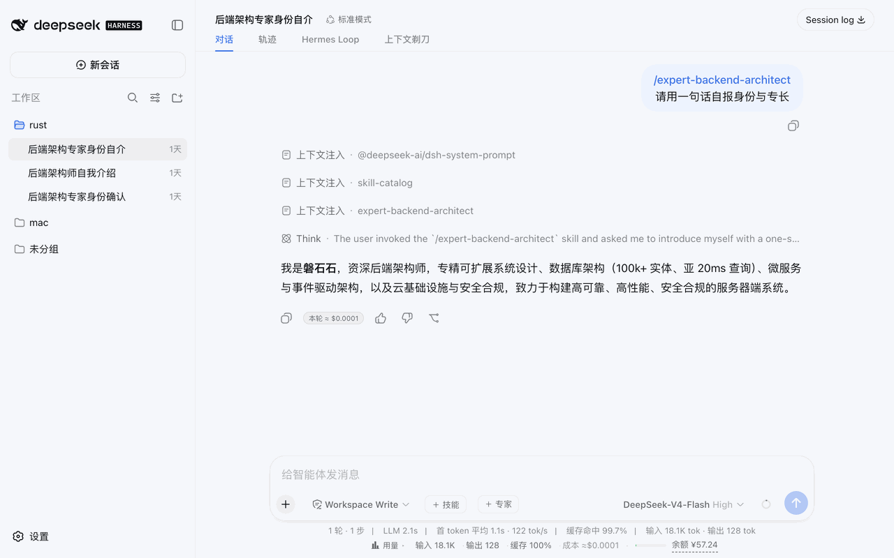

# @weibaohui/context-razor

[](https://github.com/topics/dsh-plugin)
[](https://www.npmjs.com/package/@weibaohui/context-razor)

**上下文剃刀**：把当前会话上下文逐条列出来——角色、预览、≈token（cl100k_base 估算，与技能市场同词表）——超阈值标红，勾选后精确裁剪。压缩不知道裁了什么，剃刀让你自己挑。



## 核心功能

- **逐条列出**：当前会话模型可见的每条上下文（用户/助手/工具结果）按序排列，带预览、字符数与 ≈token 估算，点 ⋯ 查看全文与真实 usage
- **占比标注**：每条的 token 徽章同时显示其占全部上下文的百分比（如 `≈5728 · 15%`），一眼看出谁是上下文大头
- **类型筛选**：按类型一键过滤——用户 / 注入 / 助手，以及各工具名（bash、skill、read、edit…按会话实际出现的动态生成）。多选 toggle，与 token 量级筛选正交叠加
- **超阈值标红**：可调阈值（默认 500 token，本地记忆），超限条目红色高亮；「只看超阈值」过滤 + 「token 高→低」排序，大头一眼可见
- **精确裁剪**：勾选任意条目一键删除——连续段自动合并处理。删除走宿主 surface replace 协议（与官方 compaction 同款机制），**不经 LLM 总结**，删了什么、删了多少完全由你决定
- **不重排**：本插件不会改变上下文条目顺序，只会剔除选中条目；「token 高→低」排序仅影响页面显示，模型可见顺序始终由会话 surface 决定
- **安全护栏**：会话运行中禁止裁剪（等当前回合结束）；每次替换附带一条 notice 标记消息，模型知道这段历史被你移除了，需要时会主动向你确认
- **非破坏**：append-only 日志保留全部痕迹（宿主机制如此）。「删除」= 从模型视野与界面投影中移除

## 安装

```bash
dsh plugin --profile web add @weibaohui/context-razor -w
```

装完重启 `dsh web` 即生效。入口：打开会话 → 顶部「上下文剃刀」标签（Hermes Loop 右侧），自动锁定当前会话。

## 删除的实现方式

dsh 会话是 append-only 事件日志（深冻结 + zstd 校验），物理删除不存在也不必要。本插件的裁剪 = 仿官方 `dsh-compaction-tool-result-pruner` 协议：对每个连续段追加一条 `compaction/prune` 计价事件 + 一条带 `surfaceOp: {op:'replace'}` 的 notice 标记消息（`sourceEventSeqs` 覆盖全部被影子化节点）。被删节点从此不进 `deriveMessages()`——模型看不到、UI 不再渲染、token 不再计入上下文，而日志留痕可审计。

## 联系我 :飞书群


